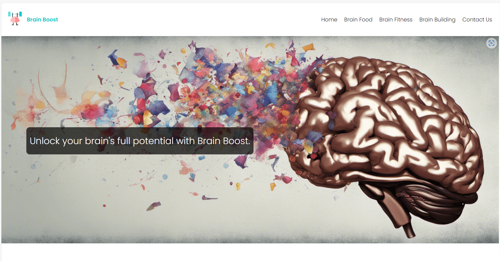
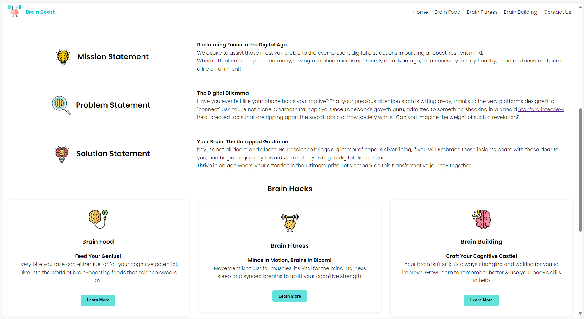
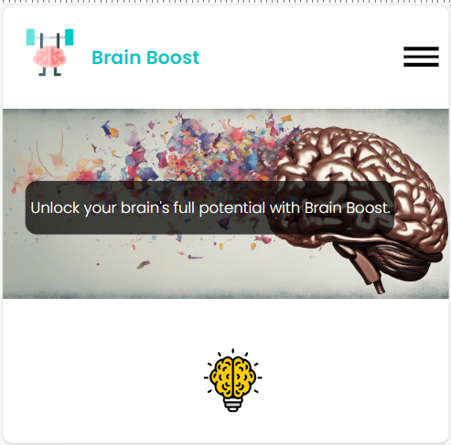
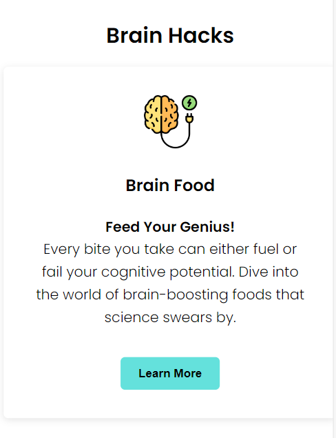

# Brain Boost - Lifehacks for Optimizing Brain Health

Recent advancements in neuroscience illuminate the brain's incredible capacity for change, growth, and resilience. Discover how you can tap into these insights and optimize your cognitive prowess.

## Code Institute - First Milestone Project: User Centric Frontend Development

# Table of Contents
- [Brain Boost - Lifehacks for Optimizing Brain Health](#brain-boost---lifehacks-for-optimizing-brain-health)
  - [Code Institute - First Milestone Project: User Centric Frontend Development](#code-institute---first-milestone-project-user-centric-frontend-development)
## Table of Contents
- [Inspiration](#inspiration)
- [Motivation](#motivation)
- [Demo](#demo)
- [UX - Experience Planes](#ux---experience-planes)
  - [Strategy](#strategy)
  - [Scope](#scope)
  - [Structure](#structure)
  - [Skeleton](#skeleton)
  - [Surface](#surface)
- [Technologies](#technologies)
- [Features](#features)
  - [MVP Features](#mvp-features)
  - [Features To Be Developed](#features-to-be-developed)
- [Testing](#testing)
  - [Validator Testing](#validator-testing)
  - [Bugs](#bugs)
- [Deployment](#deployment)
- [Credits](#credits)
  - [Content](#content)
  - [Acknowledgements](#acknowledgements)

## Inspiration
Reclaiming Focus in the Digital Age: I aspire to assist young adults and professionals—those most vulnerable to the ever-present digital distractions—in building a robust, resilient mind. In this epoch where attention is the prime currency, having a fortified mind is not merely an advantage; it's a necessity to stay healthy, maintain focus, and pursue a life of fulfillment.  
**Inspirational Figures:**
- All neuroscientists working on brain research.
- Jim Kwik
- David Goggins

## Motivation
In an era heralded by digital advancements, our brains are constantly barraged by notifications, likes, and endless scrolls. While these tools promise connection and information, they often deliver distraction and disconnection. As platforms compete fiercely for our attention, the underlying toll on our cognitive well-being becomes increasingly apparent. Studies highlight how the attention economy not only hijacks our time but corrodes our neural pathways, affecting our ability to concentrate, empathize, and even find genuine moments of happiness. This evolving challenge is especially pronounced among young adults and professionals who find their potential undermined by the very tools meant to augment their lives.
By comprehending the depth of this issue, we realize the pressing need to proactively bolster our mental resilience, fostering a mind that's not just surviving in this digital age but thriving with clarity and purpose.

## Demo
[Website look on mobile & desktop]    

### The website is hosted using github pages and can be found [here](https://osawani.github.io/Brain-Boost/)

## UX - Experience Planes
The foundation of the design and structure of this project was deeply influenced by James Garrett's "Five Planes of User Experience". Garrett's methodology breaks down the user experience design into five distinct planes: Strategy, Scope, Structure, Skeleton, and Surface. The user experience was at the forefront of every decision, from the project's conception to its final design.

### Strategy
Focus:
- Empowering users with tools, resources, and knowledge to fortify their minds against the adverse effects of the Attention Economy.

Definition:
- An interactive web application that educates users on the dangers of the Attention Economy, the significance of a strong mind, and offers actionable strategies rooted in neuroscience to optimize cognitive functions.

Value:
- Provides users with scientifically-backed methods to improve cognitive function, enhance focus, and resist distractions. This would lead to better mental health, increased productivity, and a higher quality of life.

Audience:
- Primarily targeted at young adults and professionals who are most susceptible to distractions from digital platforms. However, the content can be made accessible to anyone interested in brain health and optimization.

Relevant Content:
- Overview of the Attention Economy and its effects on the brain.
- Importance of a resilient mind in the modern era.
- Actionable neuroscientific strategies to strengthen the brain.

### Scope
Homepage:
- Brief intro about the Attention Economy and its impact.
- Testimonials or informational videos showing the benefits of brain training.
- Brain Life Hacks Cards with CTAs:
- Detailed insights into neuroplasticity, brain regeneration, and the importance of a fortified mind.
- Interactive graphics illustrating the concepts.
- Hacks & Strategies Page:
- A compilation of actionable hacks and strategies to strengthen the brain.
- Tips to mitigate distractions and improve focus.

### Structure
Interaction Design & Information Design
- Consistency of Elements: a uniform style across all web pages. For instance, the navigation bar, footers, button styles, and typography remain consistent throughout the website.
- Design Relationships: Incorporated clear call-to-action buttons on each page guiding the user to the next logical step (e.g., "Learn More", "Try a Hack", etc.)
- Information Relationships: Information is presented in a hierarchical manner. Starts with broad concepts (e.g., Attention Economy's impact) and progressively delve into details (e.g., actionable strategies, neuroplasticity research).

### Skeleton
Interface, Navigation & Information Design
- Main Navigation Bar: Positioned at the top. Contains links to Home, Hacks & Strategies, and a Contact section.
- Footer Navigation: Contains secondary links like Social Media.
- For Future Iterations: Sidebar or Pop-up: Occasional, contextually relevant prompts to guide users towards specific content or actions based on the page they're on.

How Information is Implemented:
- Cards: For different sections or topics, it is easier for users to digest information in chunks.
- Collapsible Sections: in the Hacks & Strategies page, allowing users to expand/collapse different strategies or topics.

Content Relationships:
- Visual cues (icons, different text weights) to indicate linked or related content.
- "Related Articles" and "Educational Videos" sare linked at the bottom of the landing page and embedded within the hacks.

Priority & Navigation:
- Top Priority: Introduction about the Attention Economy and its impact. This sets the context and is therefore positioned high up on the Homepage.
- Secondary Priority: The details about neuroplasticity, brain health importance, etc. This is on the Learn Page backed by scientific evidence.
- For Future Iterations: potential quizzes. Located on the Hacks & Strategies Page.

### Surface
Visual Design
- Colors: Soft neutral background (light gray or off-white) with dark text for easy reading. Accent colors (e.g., soft blue or green) for headings, links, and CTAs.
- Typography: readable font Poppins from google that is very easy on the eyes, custom line height and line weight to match the aesthetic.
- Images: High-quality images generated from Dreamstudio by stability.ai, people engaged in cognitive tasks, or abstract representations of focus and concentration.
- Appropriate Content: imagery and design choices align with the serious and educational tone of the content.
- Design Effects: Subtle shadows behind cards or images give a slight depth.
- Animations & Transitions: Fade-in effects when moving between cards. Hover effects for clickable elements.
- Guidance & Cognitive Overload: clutter is avoided. Ample white space is used. CTAs are prominent. Icons and infographics are used where possible to break up long text and provide visual context.
- For Future Iterations: Incorporate tooltips or hover-over info boxes for technical terms, easy-to-access glossaries or explanatory sidebars.

## Technologies
1. Wireframing was done using Figma & Balsamiq.
2. HTML5 was utilised to place structural elements that are semantically sound alongside attributes for SEO & accessibility
3. Vanilla CSS was used to create a minimalistic style for the html elements

## Features
### MVP Features
- Responsive design that works on desktop, tablet, and mobile.
- Clear, concise, and engaging content on the Attention Economy and brain optimization.
- A user-friendly interface with intuitive navigation.
- Integration with external resources or expert interviews.
- Footer: This section includes the social media links 

### Features To Be Develped
In the future, i would like to add following UI improvements:
- Animated sections flowing in and out using AOS Library.
- JS carousel in the hero section to vary the imagery so that it matches the pages individually.

Functional TBD Features:
- Possible quizzes or assessments to gauge the user's current cognitive state.
- Personalized Learning Paths: Algorithmically generated based on user input, behavior, and quiz results. This would likely require back-end technologies such as Python or JS.
- Community Forum: A platform for users to discuss experiences, challenges, and successes. Requires a backend, potential moderators, and community guidelines.
- Advanced Analytics & Tracking: Monitoring user progress, sending personalized content, and measuring cognitive improvements over time. Again, this would require more advanced backend technologies and perhaps some machine learning.
- Integration with Wearables: If ever the site wants to integrate real-time biofeedback from wearables to give users insights into their cognitive states.

## Testing
* I tested the site, and it works in different web browsers: Chromium based browser. Edge & Chrome.
- On mobile devices, I tested the my site on an iPhone XR with the Safari browser and with Sony Xperia 5 III which has an aspect ratio of 21:9 and the content looked good.
- The site is responsive and functions on different screen sizes when usign browser devtools.
- I confirmed that the form works without sending a http request and landing on a 403.

### Validator Testing
* **HTML**
  No errors were returned when passing through the official 

- **CSS**
  No errors were found when passing through the official
  
- **Accessibility**
  Accessibility Score is 94 in Lighthouse. Performance is below 50 even though i compressed all images using TinyPNG

### Bugs
* **Solved bugs**
  - Linking CSS worked on github pages and locally but not on codeanywhere's IDE.
  - My mentor pointed out that the i need to adjust the path format:
        `<link rel="stylesheet" href="/assets/css/style.css">`
  - Adding a '.' to the start of the file path fixed the problem.
        `<link rel="stylesheet" href="./assets/css/style.css">`

- Various CSS styling bugs related to the Box Model. See Commits with prefixes fix: & style:
  
- **Unfixed Bugs**
- I tried to use @import url('google-fonts-url') in my styles.css but the font was not loading so i resorted to using a link tag in each of the page's head section to force load the font. I am aware that this affects performance but i had no time to get to the bottom of this.
- The navigation bar does not always remain sticky. Tried different display properties combinations with no luck. I suspect it is because i am using a pseudo checkbo class to build a hamburger menu. I reckon with JS this can behave much more reliably than now.

## Deployment
* The site was deployed to Git Hub pages using the following steps:
  - In the Github repository, the Stetting tab.
  - Under General, navigate to Code and Automation and select 'Pages'.
  - In the Build and Deployment section for Source, select 'Deploy from a branch' from the drop-down list.
  - For Branch, select 'main' from the drop-down list and Save.
  - On the top of the page, the link to the complete website is provided.
  - The deployed site will update automatically upon new commits to the master branch.

## Credits
- Icons were taken from flaticon:
<a href="https://www.flaticon.com/free-icons/optimization" title="optimization icons">Optimization icons created by Paul J. - Flaticon</a>
<a href="https://www.flaticon.com/free-icons/brain" title="brain icons">Brain icons created by Shahid-Mehmood - Flaticon</a>
<a href="https://www.flaticon.com/free-icons/brain" title="brain icons">Brain icons created by VectorPortal - Flaticon</a>
<a href="https://www.flaticon.com/free-icons/paralyzed" title="paralyzed icons">Paralyzed icons created by Freepik - Flaticon</a>
<a href="https://www.flaticon.com/free-icons/creativity" title="creativity icons">Creativity icons created by Uniconlabs - Flaticon</a>
<a href="https://www.flaticon.com/free-icons/brain" title="brain icons">Brain icons created by Freepik - Flaticon</a>
<a href="https://www.flaticon.com/free-icons/effort" title="effort icons">Effort icons created by Eucalyp - Flaticon</a>
<a href="https://www.flaticon.com/free-icons/paralyzed" title="paralyzed icons">Paralyzed icons created by Freepik - Flaticon</a>

### Content
* Content was curated from research papers. These papers are linked in each of the corresponding sections.

### Acknowledgements
* Ideas were taken from the Code Institute's Coffee House and Love Running projects.
- My mentor, Medale Oluwafemi, for his guidance.
- README Skeleton inspired by https://github.com/anjalee-kulasinghe/portfolio-project1-cv-website
